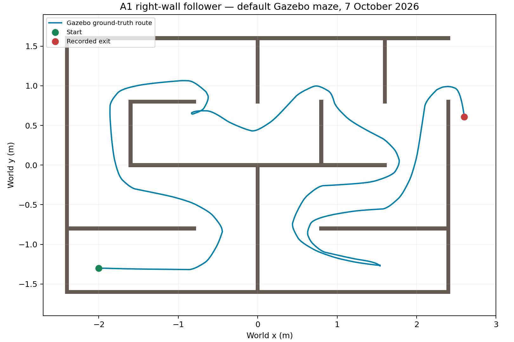

# A3 refactor — 7 October 2026

The refactor separates responsibilities in the physical Jazzy controller and the
simulation controller. It preserves both existing right-wall algorithms. A1 and
A2 remain separate executables with separate control strategies.

## Before and after

Baseline: `ed9200438d0fa73787733dccec85b87fb23e82cb`, the version already on main
with recorded offline and Gazebo evidence. Runtime refactor commits:

- `1803739`: A2 portable controller files and focused Jazzy adapter classes.
- `36b2bb6`: A1 right-wall strategy separated from shared robot motion.

| Before | After | Reason |
|---|---|---|
| A2 `WallFollower.h/.cpp` also defined settings and all scan-sector processing | `Settings`, `ScanProcessor`, `ControlTypes` and `WallFollower` have focused files | Configuration, sensor validation and steering can be read and maintained separately. |
| A2 `Turtlebot3Drive` and the process entry point shared one file; the node also selected velocity message types and owned path history | A small entry point runs `ros2::WallFollowerNode`; `CommandPublisher` owns command encoding and `TrajectoryRecorder` owns path history | ROS coordination, output encoding, recording policy and process lifetime have clear boundaries. |
| A2 controller used a heap allocation through `unique_ptr` despite having a fixed concrete type | Node owns the controller and its helper objects by value | Their lifetime follows the node; the controller needs no nullable pointer or separate allocation. |
| A1 base `CRobot` and derived `CRightWallFollowerRobot` shared header/source files | The strategy has `c_right_wall_follower_robot.h/.cpp`; shared motion stays in `c_robot.h/.cpp` | Maze decisions can be changed independently of frame transforms, waypoint history and wheel commands. |

Settings, thresholds, gains, scan sectors, numerical expressions and control-state
rules were moved without redesign. The A2 node name remains
`project1_wall_follower`, package `mtrx3760_project1`, executable `turtlebot3_drive`.
Topics, remappings, QoS, parameters/defaults, nominal 20 Hz loop, monotonic scan
timeout, Twist/TwistStamped selection and shutdown sequence are preserved.
Launch and YAML files are unchanged. The retained ROS 1 adapter is unchanged;
its portable controller dependency still builds without ROS, but ROS 1 itself
was not built or run in this Jazzy environment.

## Validation

Recorded results are in `refactor_evidence/2026-10-07/`.

| Check | Result |
|---|---|
| Portable A2 contracts | 26/26 passed |
| Jazzy CTest suite | 33/33 entries passed: 26 controller checks, six trajectory checks, and one entry containing five live ROS integration scenarios |
| Trajectory class | Exact 3 cm spacing boundary, 10,000-point capacity/oldest removal, invalid input rejection, frame reset, nanosecond timestamp reset and pose/header copying passed |
| A2 sanitizers | 26/26 passed under AddressSanitizer and UndefinedBehaviorSanitizer; leak checking disabled |
| A1 right-wall regressions | 8/8 GoogleTest cases passed |
| A1 before/after outputs | Exactly equal across 2,000 sequential generated scan/pose inputs, including velocities, wheel commands and waypoint history |
| A2 before/after outputs | Exactly equal across 2,000 sequential generated inputs, including linear/angular commands and control state |
| Workspace install | Jazzy `colcon build --symlink-install` passed; installed executable and all six launch arguments resolve |
| Gazebo end-to-end | Corrected recorder reports EXIT_REACHED at 132.801 simulation seconds; approximate sampled route length 16.876 m |

The comparison uses the same generator source, seed 30 and compiler for both
Git revisions. Hexadecimal floating-point output permits exact comparison.
`comparison.json` records hashes and revisions. This supports unchanged outputs
for the tested inputs, not a mathematical proof for every possible scan.

The Gazebo recorder also received a separate correction. Its former exit check
required the robot to remain inside a narrow coordinate box after leaving the
maze. In the first refactored run, ground truth shows the robot crossing the east
opening at simulation time 129.301 s and reaching x > 2.60 m at 132.085 s, but it
had turned to y = 0.7314 m by then. The recorder kept waiting despite the robot
already being outside; that recording was explicitly interrupted.

`EastExitDetector` now checks an outward crossing of the actual east opening
(wall outer face x = 2.425 m, opening 0.825 < y < 1.575 m), followed by x > 2.60 m.
It interpolates the crossing for discrete pose samples. Four tests cover turning
outside, wall crossings/starting outside, coarse samples and nonfinite input.
This changes the test recorder's completion criterion, not either controller.
The old raw recording is retained and the corrected recorder is rerun separately.
No contact sensor data was collected; do not claim collision-free performance.

The fresh run received 664 scans, 6,640 odometry messages, 4,024 camera images and
662 commands. It recorded the named model crossing the opening and reaching
world (2.6007, 0.6061) m outside the maze. Wall time including startup/cleanup was
138.827 s. Both baseline and first-refactor recordings also pass the new detector
when their saved poses are replayed; `exit_replay.json` contains the results.



## Reproduce

The general build/test commands in `OFFLINE_TESTS_2026-10-07.md` still apply.
The Jazzy suite now includes the six trajectory cases automatically.

```bash
source /opt/ros/jazzy/setup.bash
python3 validation/compare_controller_revisions.py \
  --baseline ed92004 --candidate HEAD --output /tmp/group30-refactor-comparison
python3 validation/test_maze_exit.py
```

The comparison builds snapshots from Git, not uncommitted working files. Its A1
trace needs the sourced Jazzy message headers but starts no ROS node and sends
no velocity messages. Outputs/build binaries stay in the requested output directory.

## Deploy the refactor to the physical workspace

After the refactor has been merged and pulled, run from the repository root:

```bash
source /opt/ros/jazzy/setup.bash
cp -a "A2 ROS/." ~/mtrx3760_ws/src/mtrx3760_project1/
cd ~/mtrx3760_ws
colcon build --symlink-install --packages-select mtrx3760_project1
source install/setup.bash
ros2 pkg executables mtrx3760_project1
ros2 launch mtrx3760_project1 wall_follower.launch.py --show-args
```

Copy the complete package: the executable now needs several source files.
The teammate's workspace path may differ. Resume the existing offline physical
guide afterwards: match robot middleware/domain, inspect actual topic types,
verify manual motion, and launch with the observed Twist/TwistStamped choice.
The currently installed physical workspace was not changed by this refactor work.

Robot data was not needed for this structural refactor. The refactored A2 must
still undergo an autonomous physical right-wall/corner/maze trial before it is
described as the demonstrated final version. Physical scan orientation, timing,
noise, wall material and tuning remain matters for robot testing.

## Design diagrams and report wording

`Report ROS/A2 classes.puml` and `Report ROS/A1 classes.puml` provide separate
simplified UML diagrams with class relationships and no member lists. The A2 ROS
node diagram now labels actual topic names. These are design sources; render and
review them using the unit's diagram standard before putting them into the PDF.

Suggested A3 design paragraph:

> We refactored the tested implementation to separate configuration, scan
> processing, steering and ROS communication. The Jazzy node coordinates a
> ROS-independent WallFollower, a CommandPublisher for Twist/TwistStamped output,
> and a TrajectoryRecorder for bounded odometry history. The controller is owned
> by value and the process entry point handles signals and shutdown separately.
> In simulation, the right-hand maze strategy moved to its own files while the
> shared robot class retained waypoint motion and wheel conversion. The numerical
> control rules and parameters were preserved. Existing regressions and exact
> before/after output comparisons passed, and a separate Gazebo run checked the
> refactored simulation executable. Physical testing of this final version is
> reported separately.

The A4 reflections must be reviewed and agreed by the team. Useful concrete
topics are the formerly mixed ROS-node responsibilities, separately testable
trajectory policy, and the remaining duplication in the retained ROS 1 adapter.
Do not invent team opinions or describe robot observations that have not happened.
Include this AI-assisted implementation and validation in the submission's AI
acknowledgement, and regenerate the C++ text appendix and Git history from the
actual final demonstrated revision.
