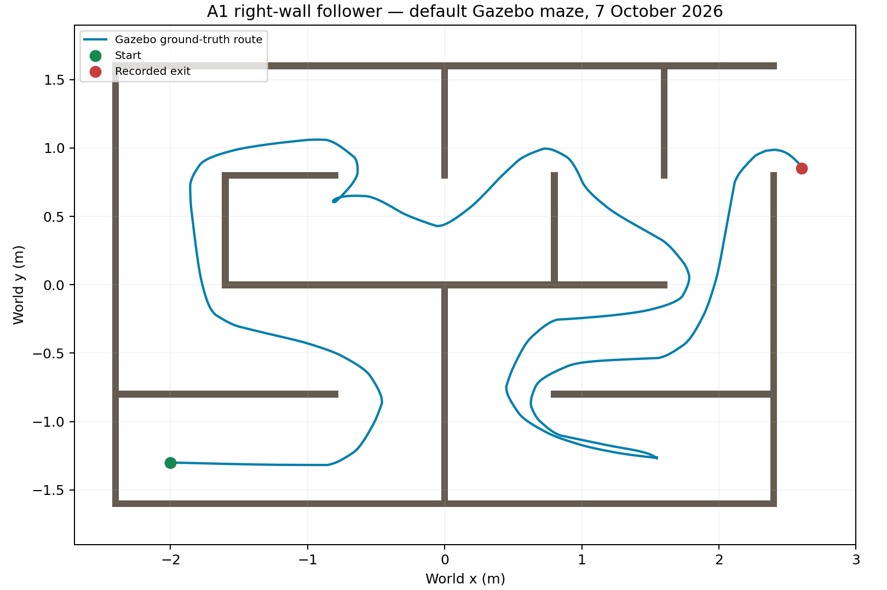
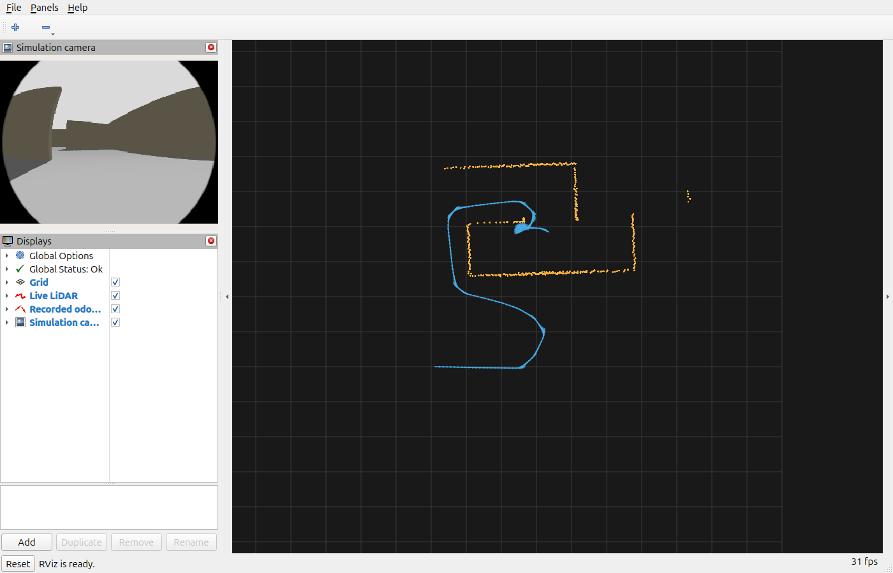

# Offline validation — 7 October 2026

These checks exercise the real project controller classes and the compiled ROS 2
adapter using generated inputs, and run A1 through the default Gazebo maze.
They provide software and simulation evidence; physical maze performance remains unverified.

## Revision and environment

- Baseline `main`: `56933a8cf96ad35294fbe010e86b658da10a4d1c`.
- Test-source revision: `7c9d7218abc12064a3ab62de64bddd9f79c2d42b`.
- Ubuntu 24.04, ROS 2 Jazzy, GCC 13.3.0, Python 3.12.3, Cyclone DDS.
- A2 controller, ROS adapters, launch files and tuning configuration are unchanged
  from the baseline. Changes add test sources, CMake test registration and test dependencies.
- ROS integration uses domain 201, localhost discovery and namespaces under
  `/group30_offline`. It launches its own executable and publishes no robot `/cmd_vel` topic.
- Results were obtained on the testing lead's desktop, with no physical robot involved.

## Results

| Check | Result | What it establishes |
|---|---|---|
| A2 controller, plain CMake | 26/26 passed | The production controller responds as expected to the listed synthetic inputs. |
| A2 controller plus compiled Jazzy adapter | 27/27 CTest entries passed | 26 controller checks and one integration entry containing five Python scenarios. |
| A2 controller with AddressSanitizer and UndefinedBehaviorSanitizer | 26/26 passed | No detected memory-access or undefined-behaviour errors on these exercised paths; leak checking was disabled. |
| Existing A1 right-wall regression suite | 8/8 GoogleTest cases passed | Geometric right-wall gap selection, steering and velocity checks remain passing. |
| Complete default Gazebo maze | Exit reached in 130.114 simulation seconds | Production A1 controller traversed the default maze; named Gazebo ground truth confirms the east exit. |
| RViz sensor display | LiDAR, camera and odometry trail displayed | A separate short run verified the evidence view and supplied a live screenshot. |
| Physical autonomous maze | Pending | Requires robot runs and recorded results. |

The 26 controller cases are repeated across builds; they are not 78 distinct tests.
There are 39 named scenarios across the A2 controller, ROS integration and A1
regression suites. The command-bounds scenario additionally samples 1,000
deterministic generated scenes using seed 30.

## Full Gazebo run

After installing `ros-jazzy-ros-gz-sim`, `ros-jazzy-ros-gz-bridge` and
`ros-jazzy-ros-gz-image`, the repository's `turtlebot3_description`,
`turtlebot3_gazebo` and `tb3_maze` packages built successfully. The recorder ran
the existing `maze.launch.py` with the `burger_cam` model, then started the actual
`tb3_maze/turtlebot3_drive` executable after sensors and ground truth arrived.
Neither simulation nor physical controller logic was changed for this test.

- Start: world (-2.0, -1.3) m, facing +x.
- Exit criterion: named `burger_cam` world pose x > 2.60 m and 0.85 < y < 1.55 m.
- Final recorded ground truth: (2.6021, 0.8518) m.
- Elapsed simulation time at exit: 130.114 s; wall time including startup/cleanup: 136.648 s.
- Approximate sampled route length: 16.547 m.
- Received: 651 scans, 6,505 odometry messages, 3,943 camera images and 649 commands.
- Maximum sampled command magnitudes: 0.14994 m/s and 1.20000 rad/s.
- Model position was read from named Gazebo JSON poses; the TF bridge drops model
  names in this installed version, so it was not used to identify ground truth.
- ROS domain 202, localhost discovery and a separate Gazebo transport partition
  isolated the run from hardware.

This is one successful run of `default_maze`, not a repeatability study or a check
of all supplied worlds. Contact sensor data was not recorded, so collision-free
performance is not established by this result. A2 was tested separately with
synthetic inputs and was not the controller used for this Gazebo route.

The first recorder attempt was interrupted to fix model identification; it is
not counted as a completed maze trial. The separate RViz evidence run intentionally
had a 55 s wall-time limit, so its `TIME_LIMIT` result denotes a partial visual
check rather than an attempted full maze trial.





## What the A2 checks do

| Component | Inputs and assertions |
|---|---|
| Settings | Reject zero, negative and nonfinite values in positive settings, nonfinite yaw and invalid threshold ordering. Accept the supplied defaults. |
| Steering | Follow an ideal right wall at 0.30 m; turn left when too close and right when too far; check both wall-heading signs. |
| Wall loss and corners | Slow right turn when the right wall disappears; blocked front takes priority; turning persists inside the threshold hysteresis band and forward following resumes once clear. |
| Timing | Zero command before the first scan and after scan expiry, backward time or nonfinite time; verify recovery with fresh valid data. |
| Scan quality | Reject corrupted sectors, missing coverage, invalid metadata and out-of-range returns; tolerate an isolated dropout. Check front minimum versus side median aggregation and positive/negative infinity handling. |
| Scan geometry | Equivalent behaviour for scans starting at zero, decreasing angles, and a correctly configured 90-degree LiDAR yaw offset. |
| Command bounds | Commands remain finite and within configured linear/angular limits over 1,000 generated scenes. |

The five integration scenarios communicate with the compiled `turtlebot3_drive`:

1. `Twist`: close/distant right-wall steering signs and zero output for all-NaN scans.
2. `TwistStamped`: tracking with configured yaw, command frame and increasing timestamps.
3. Trajectory: retained delivery to a late subscriber, 3 cm point spacing, invalid
   odometry rejection, and resets on odometry frame change or backward timestamp.
4. Shutdown: a zero stamped command is received after SIGINT while valid scans
   continue arriving, so the stop cannot be explained by scan timeout.
5. Invalid configuration: the executable exits unsuccessfully and publishes no
   velocity command when forward speed is zero.

## Reproduce the checks

Run from the repository root. Store build outputs outside the source tree.

### A2 without ROS

```bash
cmake -S "A2 ROS" -B /tmp/group30-core-tests \
  -DPROJECT1_ROS_VERSION= -DBUILD_TESTING=ON -DCMAKE_BUILD_TYPE=Debug
cmake --build /tmp/group30-core-tests -j4
ctest --test-dir /tmp/group30-core-tests --output-on-failure
```

### A2 with Jazzy

Install test dependencies through the normal ROS workspace `rosdep` step first.
`rclpy` and `rmw_cyclonedds_cpp` are declared test dependencies. The integration
script sets its isolation environment itself; it does not modify the shell or robot.

```bash
source /opt/ros/jazzy/setup.bash
cmake -S "A2 ROS" -B /tmp/group30-ros-tests \
  -DPROJECT1_ROS_VERSION=2 -DBUILD_TESTING=ON -DCMAKE_BUILD_TYPE=Debug \
  -DPython3_EXECUTABLE=/usr/bin/python3
cmake --build /tmp/group30-ros-tests -j4
ctest --test-dir /tmp/group30-ros-tests --output-on-failure
```

The adapter log for each scenario is saved in the build directory's
`ros2_test_artifacts/`. No ROS daemon or robot bring-up is needed.

### A2 memory and undefined-behaviour instrumentation

```bash
cmake -S "A2 ROS" -B /tmp/group30-sanitizer-tests \
  -DPROJECT1_ROS_VERSION= -DBUILD_TESTING=ON -DCMAKE_BUILD_TYPE=Debug \
  '-DCMAKE_CXX_FLAGS=-fsanitize=address,undefined -fno-omit-frame-pointer' \
  '-DCMAKE_EXE_LINKER_FLAGS=-fsanitize=address,undefined'
cmake --build /tmp/group30-sanitizer-tests -j4
ASAN_OPTIONS=detect_leaks=0 ctest --test-dir /tmp/group30-sanitizer-tests --output-on-failure
```

### Existing A1 suite

```bash
source /opt/ros/jazzy/setup.bash
colcon --log-base /tmp/group30-a1-tests/log build \
  --base-paths "A1 Maze Simulation/tb3_maze" \
  --build-base /tmp/group30-a1-tests/build \
  --install-base /tmp/group30-a1-tests/install \
  --cmake-args -DBUILD_TESTING=ON
ctest --test-dir /tmp/group30-a1-tests/build/tb3_maze --output-on-failure
```

This builds the controller and its regression suite. It does not launch the
TurtleBot3 Gazebo runtime.

### Full default Gazebo maze and evidence view

The recorder requires Pillow (`python3-pil`); the plotter requires Matplotlib
(`python3-matplotlib`). These were present on the validation PC. A graphical
desktop and functional rendering are needed by the existing maze launch.

```bash
source /opt/ros/jazzy/setup.bash
colcon --log-base /tmp/group30-gazebo/log build \
  --base-paths "A1 Maze Simulation" \
  --packages-select turtlebot3_description turtlebot3_gazebo tb3_maze \
  --build-base /tmp/group30-gazebo/build \
  --install-base /tmp/group30-gazebo/install
source /tmp/group30-gazebo/install/setup.bash
python3 validation/gazebo_maze_check.py --output /tmp/group30-maze-run
python3 validation/plot_gazebo_run.py --run /tmp/group30-maze-run
```

While a recorder run is active, this opens the evidence view in another terminal:

```bash
source /opt/ros/jazzy/setup.bash
source /tmp/group30-gazebo/install/setup.bash
export ROS_DOMAIN_ID=202 ROS_LOCALHOST_ONLY=1 RMW_IMPLEMENTATION=rmw_cyclonedds_cpp
ros2 run rviz2 rviz2 -d validation/gazebo_evidence.rviz --ros-args -p use_sim_time:=true
```

The evidence config only changes RViz's view and displays. Orange points are live
LiDAR returns; blue arrows form the recorded odometry trail; the left panel shows
the simulated camera. The recorder stops its own Gazebo and controller processes
after exit detection or timeout; close RViz afterwards.

## Evidence and report wording

Recorded CTest output and XML are under `evidence/2026-10-07/`. Absolute workspace
paths in text/XML are replaced with placeholders for portability; outcomes and
test output are preserved. `manifest.json` records source hashes, environment,
the baseline revision and the test-source revision. The Gazebo run's raw
`result.json` uses `world` for the maze name; final position is preserved in CSV
and `calculated_metrics.json`. The recorder subsequently renamed this metadata
key to `world_name` to retain the final pose too. Build binaries are excluded.

Suggested report text:

> On 7 October 2026, the A2 production controller passed 26 automated synthetic-input
> scenarios, including scan validation, right-wall steering, corner hysteresis,
> scan timeout and bounded commands over 1,000 generated scenes. Five additional
> scenarios exercised the compiled ROS 2 Jazzy adapter, confirming Twist and
> TwistStamped output, trajectory handling, invalid-configuration rejection and
> a shutdown zero command. The controller cases also passed with AddressSanitizer
> and UndefinedBehaviorSanitizer enabled, with leak checking disabled. The existing
> A1 right-wall suite passed all eight cases. In a separate Gazebo run, the A1
> controller reached the default maze's east exit at simulation time 130.114 s,
> confirmed by the named model's ground-truth position. Its approximate recorded
> route length was 16.547 m. Camera, LiDAR and odometry streams were also verified
> in RViz. This was one simulation run; physical maze performance must be
> established separately, and collision-free performance was not measured.

Refactoring that preserves behaviour can use these tests without robot data.
Robot data is needed to validate actual LiDAR orientation, noisy/reflective walls,
sensor timing, motion response and tuning. The current A2 design already separates
settings, scan processing, wall-following logic and the ROS adapter. These checks
add evidence without redesigning that controller.
